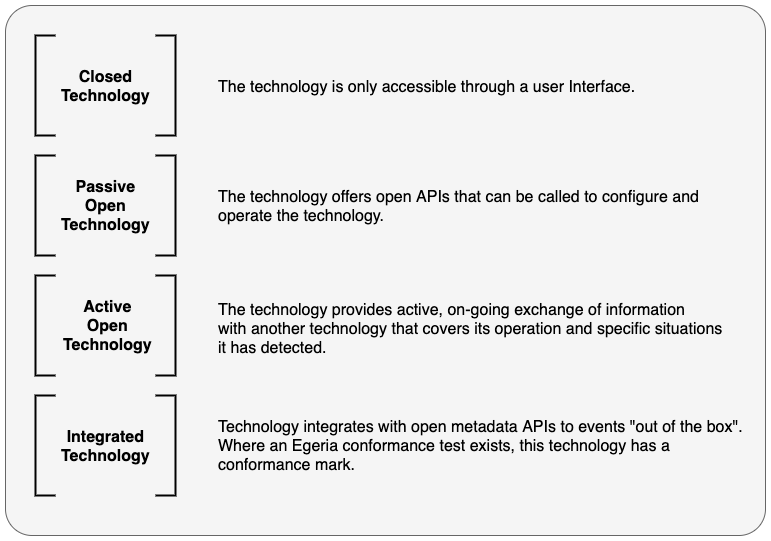
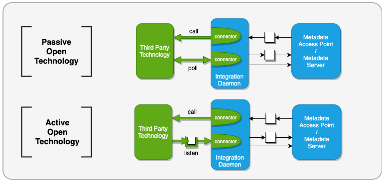

<!-- SPDX-License-Identifier: CC-BY-4.0 -->
<!-- Copyright Contributors to the ODPi Egeria project 2020. -->

# Integration Daemon

An **Integration Daemon** is an [OMAG Server](omag-server.md)
that provides metadata exchange services between third party
technology and the open metadata ecosystem.

Each integration daemon is paired with an 
[access service](../../../access-services) and supports a particular
class of technology.

> **Figure 1:** The integration daemon sitting between a third party technology and
> a metadata access point / metadata server

To understand how an integration daemon works, it is necessary to
look at a bit more detail at how technologies can be
connected together to exchange metadata.

Figure 2 show the four major mechanisms for
how a particular technology supports integration.

> **Figure 2:** Four types of integration capabilities that could be
> offered by a technology

Egeria does not provide any particular consideration for **Closed Technology**.
**Integrated Technology** is able to interact directly with a
[Metadata Access Point](metadata-access-point.md) or
[Metadata Server](metadata-server.md), as shown in Figure 3.

> **Figure 3:** Integrated technology can call the open metadata services or
> consume the open metadata services directly

The **Integration Daemons** provide support for
the **Passive Open Technology** and the **Active Open Technology**.
This is shown in Figure 4.

> **Figure 4:** Using the integration daemon to integrate
> both passive and active open technology into the open metadata ecosystem

For **Passive Open Technology**, the integration daemon will
continuously poll the technology's API to determine if
anything has changed and then pass any changes to the
metadata access point / metadata server.  It also
listens for events from its access service's 
[Out Topic](../../../access-services/docs/concepts/client-server/out-topic.md).
If there is new metadata that is of interest to the
third party technology the integration daemon passes it over.

The **Active Open Technology** support is similar except that
rather than polling for changes in the third party technology,
the integration daemon will listen on the third party
technology's event topic and translate the events it receives
and passes the information onto the access service.

The code that manages the specific APIs and formats of the third party technology
is encapsulated in a connector.  The specific type of connector
is defined by each type of integration daemon.  The connectors
are passed a context object that enables the connector to
call either the associated access service REST API, or to
push events to the access service's 
[In Topic](../../../access-services/docs/concepts/client-server/in-topic.md).

The integration daemons defined in Egeria today are as follows:

* [Data Engine Proxy](data-engine-proxy.md) is an [Integration Daemon](integration-daemon.md)
  that can capture metadata about data movement processes (such as ETL jobs)
  from a data engine.
  
* [Data Platform Server](data-platform-server.md) is an [Integration Daemon](integration-daemon.md)
  that can capture metadata about data set and data stores managed by a data
  platform, such as a database server, Apache Cassandra or Apache Hive.

* [Security Sync Server](security-sync-server.md) is an [Integration Daemon](integration-daemon.md)                                              
  that is responsible for keeping a security
  enforcement engine supplied with the latest metadata settings.

* [Virtualizer](virtualizer.md) manages the configuration of a
  data virtualization platform.

All are under development and do not yet support all of the integration
patterns.  However over time, the number of integration daemons will grow
so that there is at least one for each access service and most will
support both of the patterns described above.

----
Return the the [Governance Server Types](governance-server-types.md)

----
License: [CC BY 4.0](https://creativecommons.org/licenses/by/4.0/),
Copyright Contributors to the ODPi Egeria project.